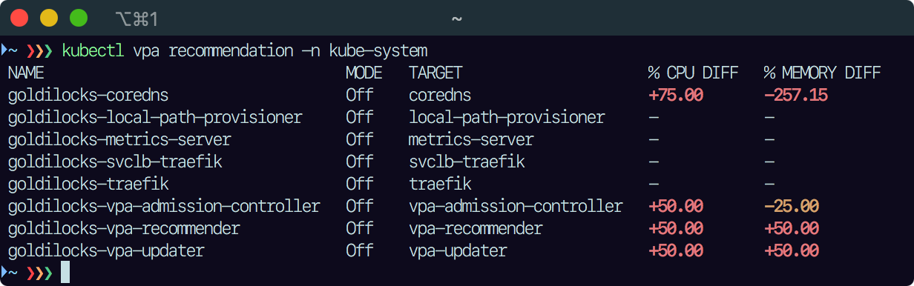
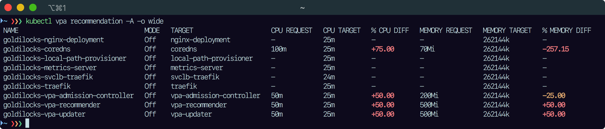

# `kubectl vpa-recommendation`

<p align="left">
    <a href="https://github.com/wI2L/kubectl-vpa-recommendation/actions"></a>
    <a href="https://goreportcard.com/report/github.com/wI2L/kubectl-vpa-recommendation"></a>
    <a href="https://github.com/wI2L/kubectl-vpa-recommendation/releases"></a>
    
    <a href="LICENSE"></a>
</p>

A `kubectl` plugin to show the difference between the recommendations of a `VerticalPodAutoscaler` and the actual resources requests of the targeted controller's pod(s).

The plugin is compatible with Kubernetes servers starting from version 1.16, which have the `autoscaling.k8s.io/v1` API group installed. See the other [prerequisites](https://github.com/kubernetes/autoscaler/tree/master/vertical-pod-autoscaler#prerequisites) for using VPAs on your cluster.

## Installation

### With [Krew](https://krew.sigs.k8s.io/)

```shell
$ kubectl krew install vpa-recommendation
$ kubectl vpa-recommendation --help
```

### Manual download

Head to the [releases](https://github.com/wI2L/kubectl-vpa-recommendation/releases) page to download an existing release for your OS/arch, and add the path to the binary to your `$PATH`.

### Build from source

:warning: `kubectl-vpa-recommendation` requires [Go 1.17+](https://golang.org/doc/install) to build.

To build the plugin yourself from the source, use the following commands:

```shell
$ git clone git@github.com:wI2L/kubectl-vpa-recommendation.git
$ cd kubectl-vpa-recommendation
$ make build
```

It creates a single binary file for the host machine platform/architecture in the `dist/` folder. Move it somewhere within your `$PATH`, such as `$GOPATH/bin`. You can then invoke it directly (`kubectl-vpa-recommendation`), or via `kubectl` (`kubectl vpa-recommendation`).

## Usage

### Demo

The following examples were produced from a brand-new Kubernetes cluster created with [`k3d`](https://k3d.io/v5.2.2/). The `VerticalPodAutoscaler` resources were automatically created by the [`goldilocks`](https://github.com/FairwindsOps/goldilocks) operator.

#### Single namespace



#### Wide output (all namespaces)



### Options

Apart from the flags defined by the [`genericclioptions`](https://pkg.go.dev/k8s.io/cli-runtime/pkg/genericclioptions) package and some [logging flags](https://github.com/kubernetes/enhancements/tree/master/keps/sig-instrumentation/2845-deprecate-klog-specific-flags-in-k8s-components), the following options are available with the plugin:
- `--all-namespaces`, `-A`: List `VerticalPodAutoscaler` resources in all namespaces
- `--namespace`, `-n`: If present, the namespace scope for the request
- `--no-colors`: Do not use colors to highlight increase/decrease percentage values
- `--no-headers`: Do not print table headers
- `--output`, `-o`: Output format. Empty string or `wide`
- `--show-containers`, `-c`: Display containers recommendations for each `VerticalPodAutoscaler` resource
- `--show-kind`, `-k`: Show the resource type for the requested object(s) and their target
- `--show-namespace`: Show resource namespace as the first column
- `--sort-columns`: Comma-separated list of column names for sorting the table. Default to `namespace,name`
- `--sort-order`: The sort order of the table columns. Either `asc` or `desc`. Default to `asc`

To view the full list of available options, use the following command:

```shell
$ kubectl vpa-recommendation --help
```

## Limitations

- Unlike the [official VPA recommender](https://github.com/kubernetes/autoscaler/blob/master/vertical-pod-autoscaler/pkg/recommender/README.md), which is fully generic and handle any kind of "scalable" resources, the plugin recognize only some *well-known* controllers such as: `CronJob`, `DaemonSet`, `Deployment`, `Job`, `ReplicaSet`, `ReplicationController`, `StatefulSet`.

## License

This plugin is licensed under the **MIT** license. See the [LICENSE](LICENSE) file.